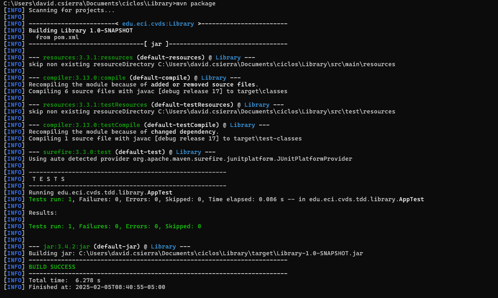

# Library

# Integrantes
**Juan Esteban Cely Lopez**

**David Santiago Castro Sierra**

#### TALLER 3
##### Testing - TDD

## PRE-RREQUISITOS
- Java OpenJDK Runtime Environment: 17.x.x
- Apache Maven: 3.9.x
- JUnit: 5.x.x
- Docker

## OBJETIVOS
1. Como hacer pruebas unitarias.
2. Utilizar anotaciones @Test del framework JUnit
3. Aplicar TDD.

## DESCRIPCIÓN PROYECTO
El proyecto consiste en un sistema de gestión de bibliotecas, donde hay clases que representan ```Libro```, ```Usuario```, ```Prestamo```, y ```Biblioteca```. Los usuarios pueden tomar prestados libros de la biblioteca, y la Biblioteca se encarga de gestionar los préstamos, asegurarse de que los libros estén disponibles, y mantener un registro de los libros prestados.
### CREAR PROYECTO CON MAVEN
Deben crear un proyecto maven con los siguientes parámetros:
```yml
Grupo: edu.eci.cvds 
Artefacto: Library 
Paquete: edu.eci.cvds.tdd 
archetypeArtifactId: maven-archetype-quickstart 
```


### AGREGAR DEPENDENCIA JUNIT5
- Buscar en maven central la dependencia de JUnit5 en su versión más reciente.
- Edite el archivo pom.xml del proyecto para agregar la dependencia.
- Verifique que la versión de java sea la 17
```xml
<properties>
  <maven.compiler.target>1.17</maven.compiler.target>
  <maven.compiler.source>1.17</maven.compiler.source>
</properties>
```
- Compile el proyecto para validar que todo este bien.
### AGREGAR ESQUELETO DEL PROYECTO
Cree los siguientes paquetes dentro de ```edu.eci.cvds.tdd```
- library
  - book
  - loan
  - user

Estos paquetes también se deben crear en la carpeta de test.
```sh
.
│ pom.xml
└───src
├───main
│ └───java
│   └───edu
│     └───eci
│       └───cvds
│         └───library
│           └───book
│           └───loan
│           └───user
│ App.java
```


### AGREGAR CLASES 
En el paquete ```edu.eci.cvds.tdd.library.book``` cree la siguiente clase:
```java
package edu.eci.cvds.tdd.library.book;

public class Book {
    private final String tittle;
    private final String author;
    private final String isbn;

    public Book(String tittle, String author, String isbn) {
        this.tittle = tittle;
        this.author = author;
        this.isbn = isbn;
    }

    public String getTittle() {
        return tittle;
    }

    public String getAuthor() {
        return author;
    }

    public String getIsbn() {
        return isbn;
    }

    @Override
    public boolean equals(Object obj) {
        return isbn.equals(((Book)obj).isbn);
    }
}
```
A continuación en el paquete ```edu.eci.cvds.tdd.library.user``` cree la siguiente clase:
```java
package edu.eci.cvds.tdd.library.user;

public class User {
    private String name;
    private String id;

    public String getName() {
        return name;
    }

    public void setName(String name) {
        this.name = name;
    }

    public String getId() {
        return id;
    }

    public void setId(String id) {
        this.id = id;
    }
}
```
En el paquete ```edu.eci.cvds.tdd.library.loan``` se deben crear las clases Loan y el enum LoanStatus:
```java
package edu.eci.cvds.tdd.library.loan;

import edu.eci.cvds.tdd.library.book.Book;
import edu.eci.cvds.tdd.library.user.User;

import java.time.LocalDateTime;

public class Loan {
    private Book book;
    private User user;
    private LocalDateTime loanDate;
    private LoanStatus status;
    private LocalDateTime returnDate;

    public Book getBook() {
        return book;
    }

    public void setBook(Book book) {
        this.book = book;
    }

    public User getUser() {
        return user;
    }

    public void setUser(User user) {
        this.user = user;
    }

    public LocalDateTime getLoanDate() {
        return loanDate;
    }

    public void setLoanDate(LocalDateTime loanDate) {
        this.loanDate = loanDate;
    }

    public LoanStatus getStatus() {
        return status;
    }

    public void setStatus(LoanStatus status) {
        this.status = status;
    }

    public LocalDateTime getReturnDate() {
        return returnDate;
    }

    public void setReturnDate(LocalDateTime returnDate) {
        this.returnDate = returnDate;
    }
}
```
```java
package edu.eci.cvds.tdd.library.loan;

public enum LoanStatus {
    ACTIVE, RETURNED
}
```
por último se debe crear la siguiente clase en el paquete ```edu.eci.cvds.tdd.library```

```java
package edu.eci.cvds.tdd.library;

import edu.eci.cvds.tdd.library.book.Book;
import edu.eci.cvds.tdd.library.loan.Loan;
import edu.eci.cvds.tdd.library.user.User;

import java.util.ArrayList;
import java.util.HashMap;
import java.util.List;
import java.util.Map;

/**
 * Library responsible for manage the loans and the users.
 */
public class Library {

    private final List<User> users;
    private final Map<Book, Integer> books;
    private final List<Loan> loans;

    public Library() {
        users = new ArrayList<>();
        books = new HashMap<>();
        loans = new ArrayList<>();
    }

    /**
     * Adds a new {@link edu.eci.cvds.tdd.library.book.Book} into the system, the book is store in a Map that contains
     * the {@link edu.eci.cvds.tdd.library.book.Book} and the amount of books available, if the book already exist the
     * amount should increase by 1 and if the book is new the amount should be 1, this method returns true if the
     * operation is successful false otherwise.
     *
     * @param book The book to store in the map.
     *
     * @return true if the book was stored false otherwise.
     */
    public boolean addBook(Book book) {
        //TODO Implement the logic to add a new book into the map.
        return false;
    }

    /**
     * This method creates a new loan with for the User identify by the userId and the book identify by the isbn,
     * the loan should be store in the list of loans, to successfully create a loan is required to validate that the
     * book is available, that the user exist and the same user could not have a loan for the same book
     * {@link edu.eci.cvds.tdd.library.loan.LoanStatus#ACTIVE}, once these requirements are meet the amount of books is
     * decreased and the loan should be created with {@link edu.eci.cvds.tdd.library.loan.LoanStatus#ACTIVE} status and
     * the loan date should be the current date.
     *
     * @param userId id of the user.
     * @param isbn book identification.
     *
     * @return The new created loan.
     */
    public Loan loanABook(String userId, String isbn) {
        //TODO Implement the login of loan a book to a user based on the UserId and the isbn.
        return null;
    }

    /**
     * This method return a loan, meaning that the amount of books should be increased by 1, the status of the Loan
     * in the loan list should be {@link edu.eci.cvds.tdd.library.loan.LoanStatus#RETURNED} and the loan return
     * date should be the current date, validate that the loan exist.
     *
     * @param loan loan to return.
     *
     * @return the loan with the RETURNED status.
     */
    public Loan returnLoan(Loan loan) {
        //TODO Implement the login of loan a book to a user based on the UserId and the isbn.
        return null;
    }

    public boolean addUser(User user) {
        return users.add(user);
    }

}
```
Para validar que la estructura del proyecto está bien se debe compilar usando el comando ```package```.



## PRUEBAS UNITARIAS Y TDD
Para poder implementar los métodos ```addBook, loanABook y returnLoan``` de la clase ```Library``` vamos a aplicar la técnica de TDD, por cada caso de prueba se debe hacer un commit, cada commit debe tener la prueba nueva y la implementación para que la prueba del commit funcione. Las pruebas anteriormente implementadas deben continuar funcionando.
Como están trabajando en parejas es necesario trabajar en ramas independientes y utilizar Pull Request para mezclar los cambios.

### CREAR CLASE DE PRUEBA
Es necesario crear la clase de prueba para ```edu.eci.cvds.tdd.Library```, la clase debe seguir los estándares de nombres estudiados en clase.

Para pensar en los casos de pruebas lean detenidamente el javadoc de los métodos para reconocer las clases de equivalencia, basados en las clases de equivalencia se debe crear una prueba la cual debe fallar y posteriormente implementar el código necesario para que funcione, este proceso se debe repetir hasta cumplir con la especificación definida en el javadoc.
