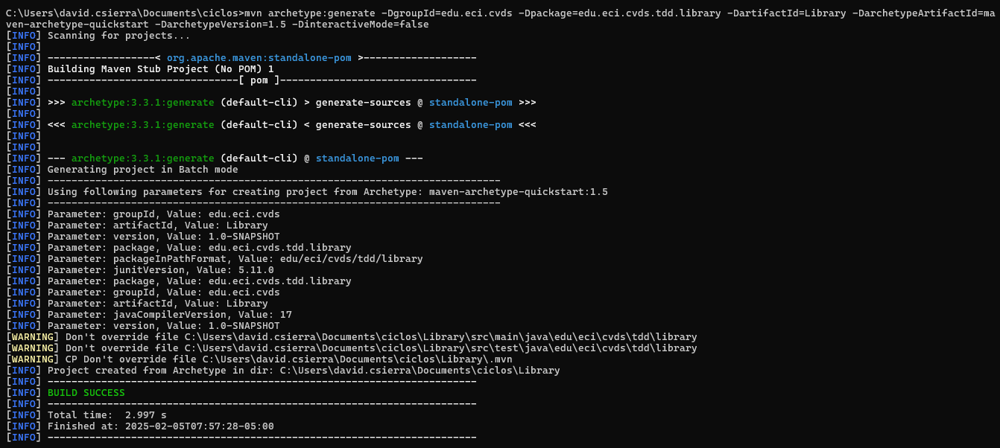
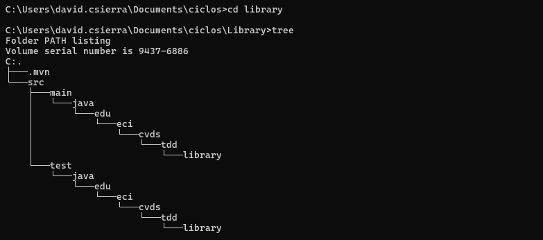
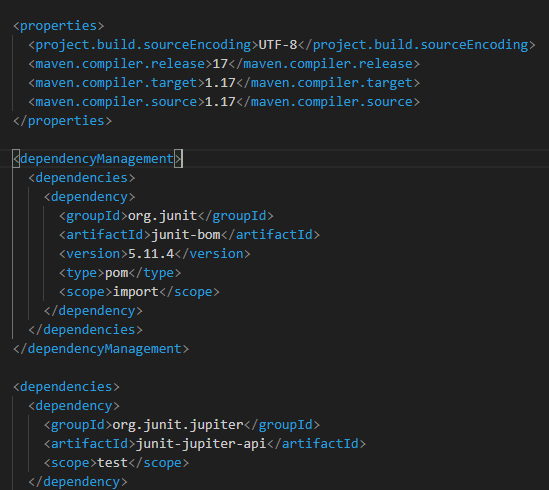

# Library

# Integrantes
**Juan Esteban Cely Lopez**

**David Santiago Castro Sierra**

#### TALLER 3
##### Testing - TDD

## PRE-RREQUISITOS
- Java OpenJDK Runtime Environment: 17.x.x
- Apache Maven: 3.9.x
- JUnit: 5.x.x
- Docker

## OBJETIVOS
1. Como hacer pruebas unitarias.
2. Utilizar anotaciones @Test del framework JUnit
3. Aplicar TDD.

## DESCRIPCIÓN PROYECTO
El proyecto consiste en un sistema de gestión de bibliotecas, donde hay clases que representan ```Libro```, ```Usuario```, ```Prestamo```, y ```Biblioteca```. Los usuarios pueden tomar prestados libros de la biblioteca, y la Biblioteca se encarga de gestionar los préstamos, asegurarse de que los libros estén disponibles, y mantener un registro de los libros prestados.
### CREAR PROYECTO CON MAVEN
Deben crear un proyecto maven con los siguientes parámetros:
```yml
Grupo: edu.eci.cvds 
Artefacto: Library 
Paquete: edu.eci.cvds.tdd 
archetypeArtifactId: maven-archetype-quickstart 
```


### AGREGAR DEPENDENCIA JUNIT5
- Buscar en maven central la dependencia de JUnit5 en su versión más reciente.
- Edite el archivo pom.xml del proyecto para agregar la dependencia.
- Verifique que la versión de java sea la 17
```xml
<properties>
  <maven.compiler.target>1.17</maven.compiler.target>
  <maven.compiler.source>1.17</maven.compiler.source>
</properties>
```
- Compile el proyecto para validar que todo este bien.
### AGREGAR ESQUELETO DEL PROYECTO
Cree los siguientes paquetes dentro de ```edu.eci.cvds.tdd```
- library
  - book
  - loan
  - user

Estos paquetes también se deben crear en la carpeta de test.
```sh
.
│ pom.xml
└───src
├───main
│ └───java
│   └───edu
│     └───eci
│       └───cvds
│         └───library
│           └───book
│           └───loan
│           └───user
│ App.java
```




### AGREGAR CLASES 
